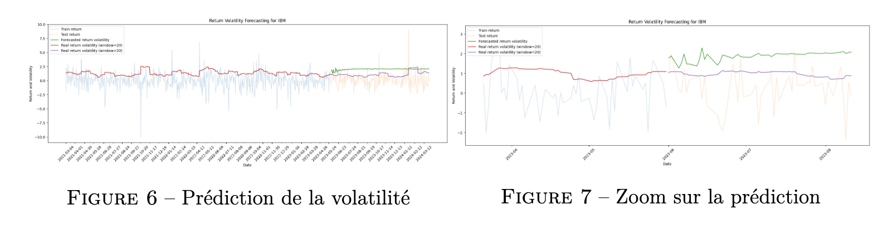
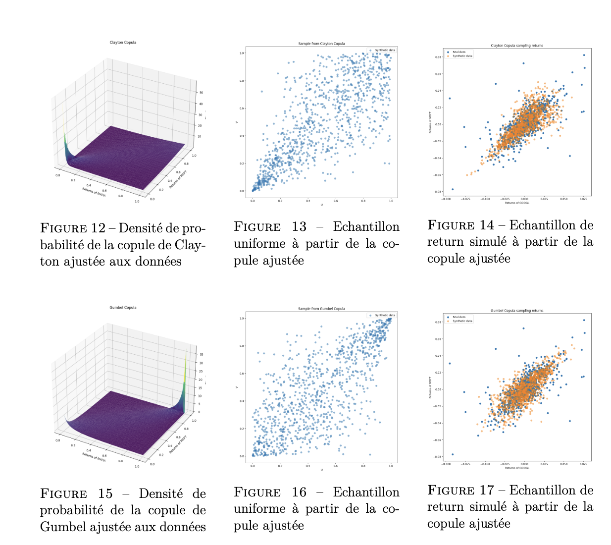
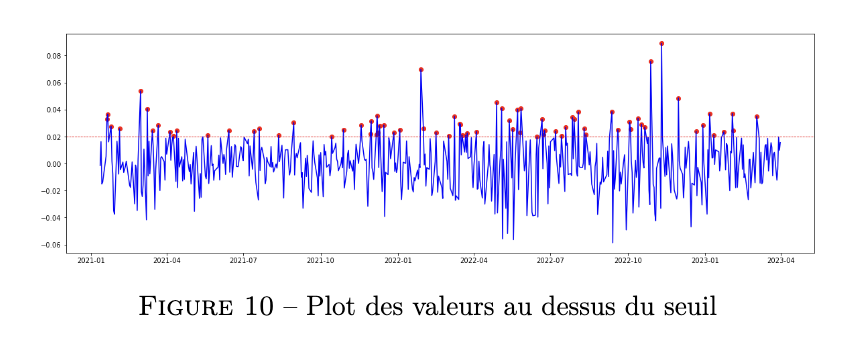
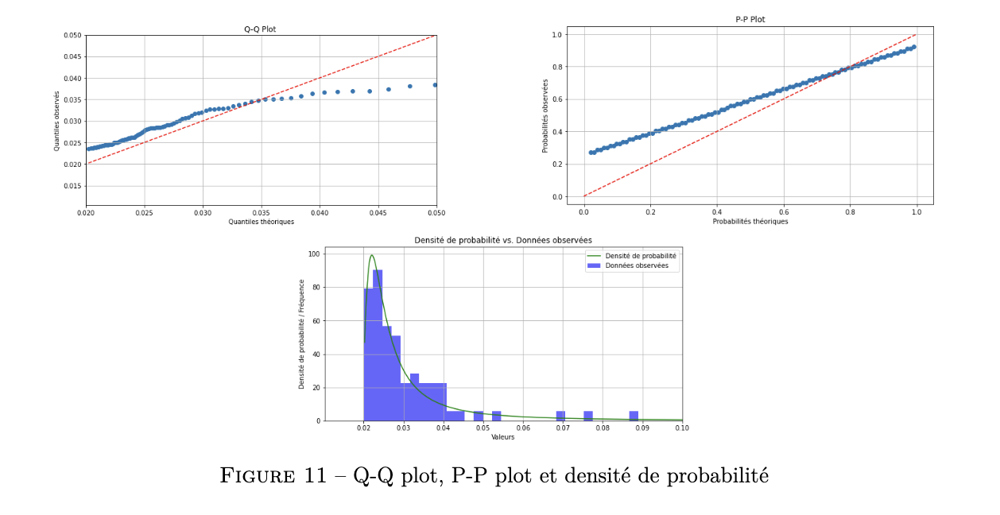

# Analyse Financière et Modélisation

Ce projet porte sur l'analyse financière à l'aide de techniques statistiques avancées, y compris la modélisation de la volatilité, l'interpolation par krigeage et l'utilisation de processus gaussiens.

## Table des matières

1. [Introduction](#introduction)
2. [Analyse par des processus de GARCH](#analyse-par-des-processus-de-garch)
3. [Processus Gaussiens et interpolation par krigeage](#processus-gaussiens-et-interpolation-par-krigeage)
4. [Modélisation par Copules](#modélisation-par-copules)
5. [Analyse des Valeurs Extrêmes](#analyse-des-valeurs-extrêmes)
6. [Bibliographie](#bibliographie)

## Introduction

Ce projet explore des modèles statistiques pour l'analyse des rendements d'actifs financiers, en se concentrant sur la gestion des risques et la prévision de la volatilité. Nous utilisons des modèles GARCH pour modéliser la volatilité conditionnelle et des processus gaussiens pour l'interpolation de données.

## Analyse par des processus de GARCH

### Modèles ARCH et GARCH

Nous avons introduit les modèles ARCH (Autoregressive Conditional Heteroskedasticity) et GARCH (Generalized Autoregressive Conditional Heteroskedasticity) pour modéliser les rendements des actifs en tenant compte de la volatilité. Le modèle GARCH(1,1) a été ajusté, avec des résultats significatifs indiquant une dépendance de la volatilité sur les rendements passés.

### Test de McLeod-Li

Nous avons effectué le test de McLeod-Li pour détecter la présence d'effets ARCH dans les résidus, avec des résultats suggérant des effets significatifs, ce qui nous a conduits à poursuivre notre analyse avec le modèle GARCH.

### Ajustement du Modèle GARCH(P,Q)

L'ajustement du modèle GARCH a permis d'obtenir des paramètres de prédiction qui capturent la structure de la volatilité. Nous avons observé que le modèle est efficace à court terme mais moins fiable pour des prévisions à long terme.

### Prévision de la volatilité

Nous avons exploré deux méthodes de prévision de la volatilité :
1. **Prévision à N Pas en Avance** : Limitée aux prévisions à court terme.
2. **Prévision en Temps Réel d'un Pas en Avant** : Mettant à jour le modèle quotidiennement pour des prévisions plus fiables.

### Évaluation du Modèle

Le test de Jarque-Bera a été appliqué pour vérifier la normalité des erreurs du modèle, et les résultats ont indiqué la nécessité d'explorer des distributions plus adaptées, comme la distribution de Student.


## Processus Gaussiens et interpolation par krigeage

### Processus Gaussien

Nous avons défini un vecteur aléatoire gaussien et discuté de l'importance du choix du noyau pour la fonction de covariance. Nous avons utilisé le noyau Matern pour capturer la dépendance spatiale dans les données.

### Krigeage par processus gaussien

Le krigeage a été utilisé pour faire des prédictions à partir de données connues. Nous avons montré que cette méthode est appropriée pour estimer des valeurs intermédiaires.

### Estimation par maximum de vraisemblance

Nous avons maximisé la fonction de vraisemblance pour calibrer notre modèle et capturer la structure de dépendance spatiale.

### Application à nos données

Nous avons appliqué le krigeage pour prédire les prix des actions à partir des valeurs horaires, en générant un intervalle de confiance de 95%.


## Modélisation par Copules

The `copules.ipynb` notebook implements copula models to analyze dependencies between financial assets. Copulas allow us to capture complex relationships between variables that cannot be fully explained by correlation alone. In this notebook, we explore various types of copulas (such as Gaussian and t-Copulas) and their applications in risk management and portfolio optimization.

### Key Steps:
- Load financial data and preprocess it.
- Fit different copula models to the data.
- Analyze the results and visualize the dependency structures.



## Analyse des Valeurs Extrêmes

The extreme value analysis is conducted in the relevant notebooks to assess the behavior of financial time series in the tails of the distribution. This is crucial for understanding the likelihood of extreme events, such as market crashes or unexpected surges.

### Key Steps:
- Apply extreme value theory (EVT) to financial data.
- Estimate the parameters of the extreme value distribution.
- Conduct simulations to predict the probability of extreme losses or gains.

By studying extreme values, we can better manage risk and prepare for potential market volatility.




## Structure of the repository 

The structure is :

```bash
├── GARCH.ipynb
├── LICENSE
├── MAP_565_report.pdf
├── README.md
├── copules.ipynb
├── get_financial_data.ipynb
├── kriging.ipynb
├── series_chronologiques.ipynb
├── figures
│   ├── ...
├── sources
│   ├── ...
└── utils
    └── functions.py
```

There are these different files : 
- `report.pdf: Where you can find the final report.
- `get_financial_data.ipynb`: Contains functions to fetch financial data from online sources.
- `GARCH.ipynb`: Focuses on modeling financial time series volatility using GARCH models.
- `copules.ipynb`: Implements copula methods to analyze dependencies between random variables.
- `kriging.ipynb`: Demonstrates the kriging method for spatial interpolation.
- `series_chronologiques.ipynb`: Explores time series analysis techniques.


## Bibliographie

Une bibliographie complète est incluse à la fin du document pour référencer les travaux et études utilisés dans ce projet.
